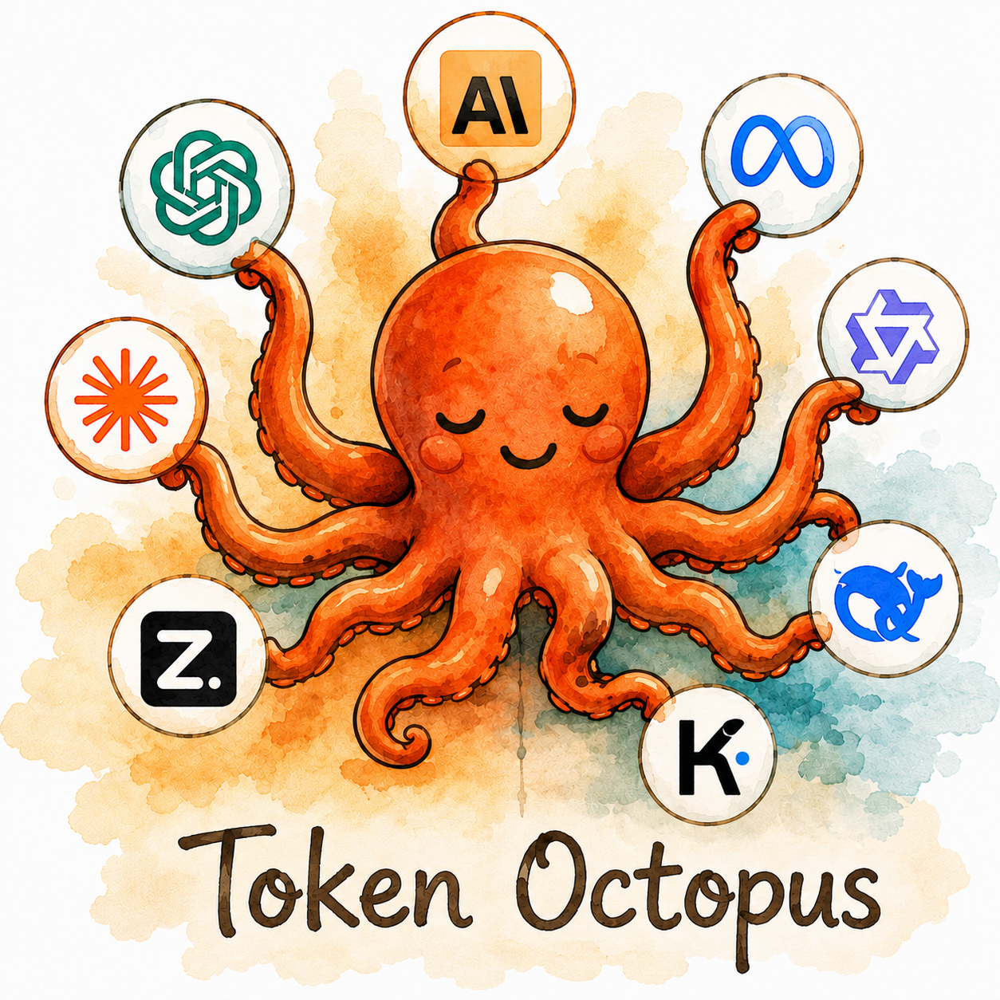

# ai-usage

[](https://www.apple.com/macos/)
[](https://www.swift.org/)
[](./LICENSE)

<p align="center">
  
</p>

A macOS menu-bar app that shows your usage and quota across many AI providers
at a glance. Add only the platforms you use. The menu bar, popover, and widgets
adapt to whatever providers you configure.

## What it is

**ai-usage** is a native macOS utility. It tracks API usage, quota, and spend
across the AI platforms you use. It lives in your menu bar — no Dock icon — and
can sit on your desktop as widgets.

- **Menu bar** — glance at your most-used provider's remaining quota.
- **Popover** — click the icon for a full breakdown across every provider you
  set up.
- **Widgets** — pin a provider's stats to Notification Center or your desktop.

It is a real macOS app:

- No Dock icon and no app-switcher entry. Just a menu-bar item (`MenuBarExtra` +
  `LSUIElement`).
- No proxy and no Electron. It calls each provider's API with native
  `URLSession`.
- Your API keys stay on the machine. They live in the **macOS Keychain**.

## Vision

One pane of glass for your AI usage. Most developers use more than one AI
platform — a coding plan here, an API key there, a subscription somewhere else.
ai-usage brings them together, so you always know how much you have left. No
need to open four browser tabs.

## Supported providers

| Provider    | Status      | What it tracks                                    |
|-------------|-------------|---------------------------------------------------|
| z.ai        | ✅ Done     | GLM Coding Plan quota, token window, peak hours   |
| Claude      | ✅ Done¹    | Claude Code plan usage via the `claude` CLI       |
| DeepSeek    | ✅ Done     | Prepaid balance — total, granted, topped-up       |
| OpenAI      | Planned     | API usage, token spend, billing                   |
| Moonshot    | Planned     | API usage, token consumption                      |

> ¹ Claude reads usage from the **Claude Code CLI**. See
> [Claude Code setup](#claude-code) below.

Providers are **pluggable**. Each one is its own module behind a shared
protocol. Add or remove any provider without touching the others or the core
app.

## Architecture

ai-usage follows an **orthogonal provider architecture**:

```
┌────────────────────────────────────────────┐
│                  App Layer                   │
│  ┌──────────┐  ┌──────────┐  ┌──────────┐  │
│  │ Menu Bar │  │ Popover  │  │ Widgets  │  │
│  └────┬─────┘  └────┬─────┘  └────┬─────┘  │
│       └──────────────┼──────────────┘       │
│                      │                      │
│  ┌───────────────────▼───────────────────┐  │
│  │            Provider Hub               │  │
│  │   (registry, refresh, aggregation)    │  │
│  └───────────────────┬───────────────────┘  │
│                      │                      │
│     ┌────────────────┼────────────────┐     │
│     ▼                ▼                ▼     │
│  ┌──────┐  ┌──────┐  ┌──────┐  ┌──────────┐│
│  │ z.ai │  │DeepSk│  │Claude│  │ OpenAI … ││
│  └──────┘  └──────┘  └──────┘  └──────────┘│
│           Provider implementations          │
└────────────────────────────────────────────┘
```

- **Provider protocol** — one Swift protocol (`AIProvider`) that every provider
  implements. It defines quota fetching, authentication, and display metadata.
- **Provider hub** — owns the registry of active providers, runs the refresh
  cadence, and hands aggregated data to the UI.
- **UI layer** — menu bar, popover, and widgets read the hub's published state.
  They know nothing about a provider's API.

To add a provider, you implement one protocol and register it. No other files
change.

## Requirements

- **Apple Silicon** (M1 or newer). Intel Macs that run Sonoma work too, but
  they are not the main target.
- macOS **14.0 (Sonoma)** or newer.
- To build from source: **Swift 5.9+**. Install the Xcode Command Line Tools
  with `xcode-select --install`.
- Dev tools: **SwiftFormat** and **SwiftLint**, pinned by version in
  [`Mintfile`](./Mintfile). Install the pinned versions with Mint
  (`brew install mint && mint bootstrap --link`) or with Homebrew
  (`brew install swiftformat swiftlint`, matching the versions in `Mintfile`).
- API keys for the providers you want to track.

### Claude Code (optional, only if you track Claude Code usage)

The Claude provider reads usage from the **Claude Code CLI** (`claude`) — not
from the Claude desktop app or from editor integrations like Zed's Claude
agent. Those are separate products. They share the Claude brand, but they do
not feed AI Usage.

**Install the CLI.** Run this in your terminal:

```sh
curl -fsSL https://claude.ai/install.sh | bash
```

**Verify it.** Open a *new* terminal session so `PATH` reloads:

```sh
which claude
# expected: /Users/<you>/.local/bin/claude
```

**Log in.** AI Usage reads the usage Claude Code already fetched for your
account. It never handles your credentials. Make sure `claude` is logged in.

The Claude desktop app (`/Applications/Claude.app`) is **not** a substitute.
Its bundled `claude` binary sits under a versioned
`~/Library/Application Support/Claude/...` path that changes on every update,
and it is not meant to be run on its own.

Once `claude` is on your `PATH`, open AI Usage → Settings → Claude Code and
click **Install Helper**. The helper hooks into Claude Code's `statusLine`
command and writes a small cache file that AI Usage reads on refresh.

> **You no longer run anything by hand.** When you click **Refresh**, AI Usage
> spawns `claude -p "/usage"` in the background, reads the usage figures, and
> updates the cache itself. This works even if you drive Claude Code from an
> editor and never open its status line. During interactive Claude Code
> sessions, the status-line helper keeps the cache fresh on its own.

## Installation

Pre-built builds live on the [GitHub Releases page](https://github.com/victorhqc/ai-usage/releases).
Download the `AI-Usage-<version>-arm64.dmg` for the release you want, then:

1. **Mount the DMG** by double-clicking it.
2. **Drag AI Usage to /Applications** (use the `/Applications` shortcut inside
   the DMG window).
3. **Launch from /Applications.** The app lives in the menu bar — there is no
   Dock icon.

### First launch (unsigned builds)

Current releases are **unsigned** (ad-hoc signed). macOS Gatekeeper will block
the app on first launch. This is a transitional state — the moment an Apple
Developer Program membership is configured, releases automatically become
signed and notarized with no action on your part.

To open an unsigned build, do **one** of:

- **Right-click** AI Usage in /Applications → **Open** → confirm the prompt.
  Only needed once; subsequent launches work by double-clicking.
- Or clear the quarantine flag from the terminal:

  ```sh
  xattr -cr '/Applications/AI Usage.app'
  ```

Signed + notarized builds (when available) launch with no Gatekeeper warning
and need none of the above.

### Build from source

If you're on Intel, want the latest `main`, or prefer to build yourself:

```bash
git clone https://github.com/victorhqc/ai-usage.git
cd ai-usage
swift run
```

To produce a DMG locally (mirrors what CI does), install `create-dmg` first:

```sh
brew install create-dmg
scripts/build-dmg.sh --version 0.1.0 --no-sign
# → dist/AI-Usage-0.1.0-arm64.dmg
```

## Status

**Early development.** The Core protocol, the Keychain wrapper, and the z.ai,
Claude, and DeepSeek providers are in place. The app builds and runs as a
menu-bar item. More providers and widgets come next.

See [`specs/`](specs/) for the spec files that drive the work.

## Contributing

We follow a **spec-first** workflow: write the spec, implement one item, run
the validation gate, then review. Read [`CONTRIBUTING.md`](CONTRIBUTING.md) for
the full workflow, coding standards, and the validation gate. The deeper agent
guide lives in [`AGENTS.md`](AGENTS.md).

### Quick start

Clone the repo and run the app:

```bash
git clone https://github.com/victorhqc/ai-usage.git
cd ai-usage
swift run
```

See [Installation](#build-from-source) for producing a DMG locally.

## Security

- API keys live as **Keychain generic-password items**. They are never written
  to disk in plaintext and never logged.
- Keys go **only to their own provider's API**, over HTTPS.
- **No telemetry, no analytics, no remote logging.** The only outbound requests
  are the provider API calls that fetch your usage.

## License

[MIT](./LICENSE) © 2026 Victor Quiroz Castro.
