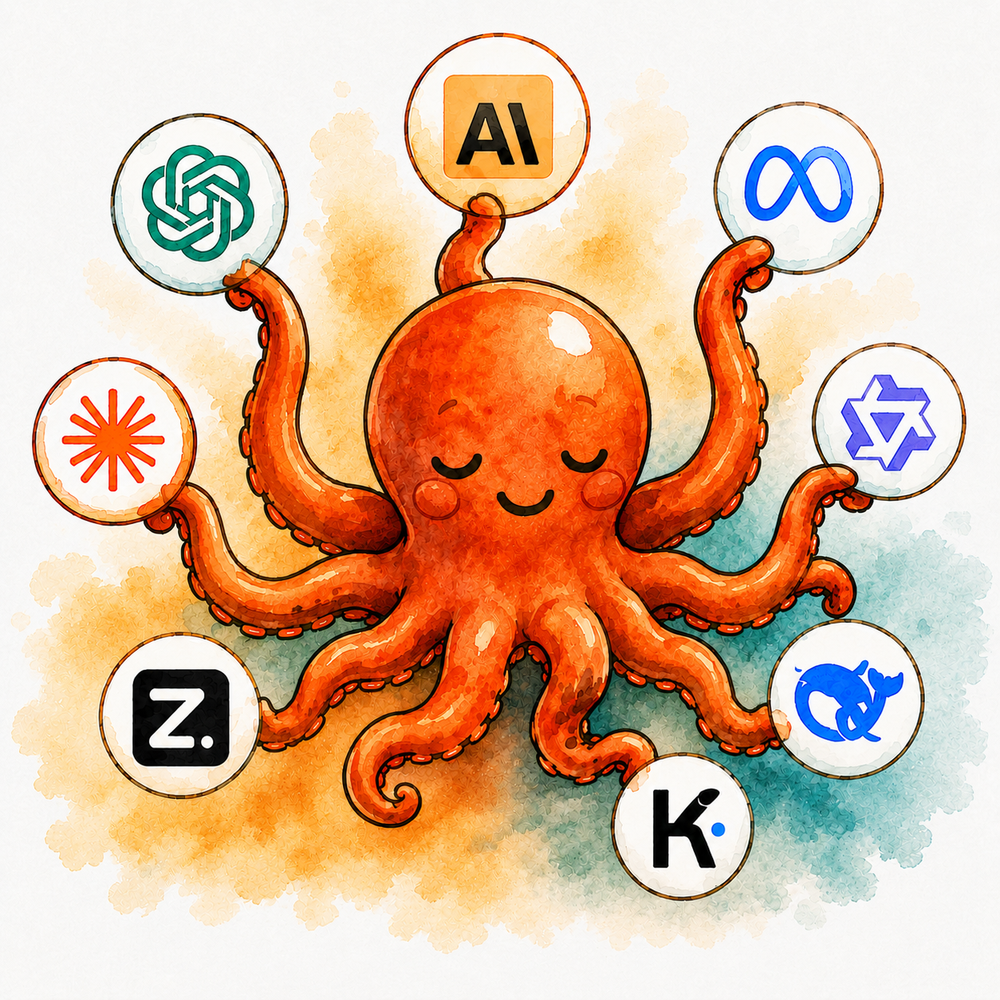
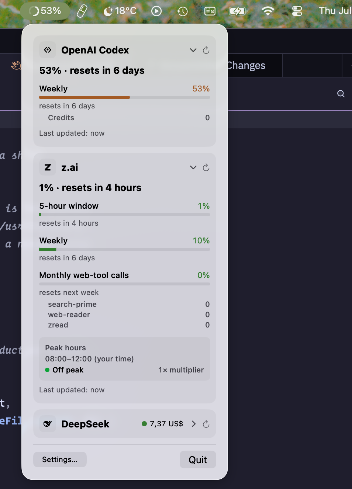
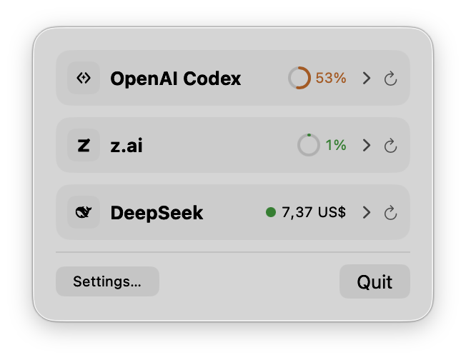
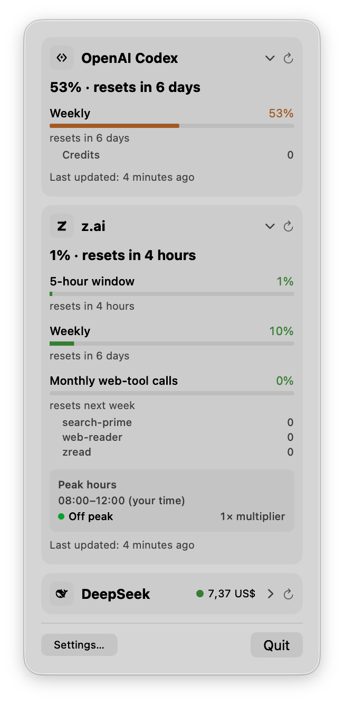

# Filbert

[](https://www.apple.com/macos/)
[](https://www.swift.org/)
[](./LICENSE)

<p align="center">
  
</p>

**Filbert** is a simple, friendly menu-bar companion that tells you when your
token budgets are running low. The name stands for **F**riendly **I**con
**L**etting **B**udgets **E**xplain **R**emaining **T**okens.

Add the platforms you use, and Filbert tracks usage, quota, and spend across all
of them at once.

Most developers use more than one AI platform. A coding plan here, an API key
there, a subscription somewhere else. This app brings them together, so you
never have to open four browser tabs to check what you have left.

<table>
  <tr>
    <td></td>
    <td></td>
    <td></td>
  </tr>
</table>

## What you get

- **Menu bar** — glance at your most-used provider's remaining quota.
- **Popover** — click the icon for a full breakdown across every provider.
- **Widgets** — pin a provider's stats to Notification Center or your desktop (WIP).

It is a real macOS app, built to stay out of your way:

- No Dock icon. No app-switcher entry. Just a menu-bar item.
- No proxy. No Electron. It calls each provider's API with native `URLSession`.
- Your API keys stay on your machine, in the **macOS Keychain**.
- No telemetry. No analytics. No remote logging.

## Supported providers

| Provider     | Status    | What it tracks                                  |
|--------------|-----------|-------------------------------------------------|
| z.ai         | ✅ Done   | GLM Coding Plan quota, token window, peak hours |
| Claude       | ✅ Done¹  | Claude Code plan usage via the `claude` CLI     |
| DeepSeek     | ✅ Done   | Prepaid balance — total, granted, topped-up     |
| OpenAI Codex | ✅ Done²  | Subscription usage via the local `codex` CLI    |
| Cursor       | ✅ Done³  | Subscription + on-demand spend via local token  |
| Moonshot     | Planned   | API usage, token consumption                    |

> ¹ Claude reads usage from the **Claude Code CLI**. See
> [Claude Code setup](#claude-code-setup) below.
>
> ² OpenAI Codex reads usage from the local **Codex CLI**. See
> [OpenAI Codex setup](#openai-codex-setup) below.
>
> ³ Cursor reads usage from your local Cursor session token. See
> [Cursor setup](#cursor-setup) below.

You only add the platforms you use. The menu bar, popover, and widgets adapt to
whatever you configure.

## Requirements

- **Apple Silicon** (M1 or newer). The released DMG is arm64-only.
- macOS **26 (Tahoe)** or newer. The app is built against the macOS 26 SDK.
  Older systems render an outdated popover and are no longer supported.
- API keys for the providers you want to track.

## Install

Pre-built builds live on the [GitHub Releases page](https://github.com/victorhqc/filbert/releases).
Download the `Filbert-<version>-arm64.dmg`, then:

1. **Mount the DMG** by double-clicking it.
2. **Drag Filbert to /Applications** — use the `/Applications` shortcut inside
   the DMG window.
3. **Launch it.** The app lives in the menu bar. There is no Dock icon.

### First launch on an unsigned build

Current releases are **unsigned** (ad-hoc signed), so macOS Gatekeeper blocks
them on first launch. This is temporary. Once an Apple Developer Program
membership is set up, releases become signed and notarized on their own, with no
action from you.

To open an unsigned build, do **one** of these:

- **Right-click** Filbert in /Applications → **Open** → confirm the prompt. You
  only do this once. Later launches work with a double-click.
- Or clear the quarantine flag from the terminal:

  ```sh
  xattr -cr '/Applications/Filbert.app'
  ```

Signed and notarized builds, when available, launch with no warning and need
none of this.

### Upgrading from ai-usage

Filbert automatically carries forward saved provider keys and preferences on
first launch. If the ai-usage Claude status-line helper is installed, Filbert
also compiles its new helper, preserves any user-owned status-line command,
moves a valid cache, and removes the old helper only after verifying the new
configuration. A failed helper migration leaves the old setup intact and shows
an **Install Helper** retry in Settings.

Because Filbert has a new bundle identifier and app name, `AI Usage.app` may
remain beside `Filbert.app` in `/Applications`. Quit and remove the old app
after confirming Filbert has your configuration.

## Use it

Open Filbert, click the menu-bar icon, and go to **Settings** to add a
provider. Enter its API key. The key goes straight into the Keychain. From then
on the app refreshes usage on its own — one refresh every five minutes by
default.

Three providers read from a local session instead of an API key. Set those up
below.

### OpenAI Codex setup

*Only if you track Codex usage.*

The OpenAI Codex provider reads subscription usage from the local `codex` CLI.
Install it, then check the version:

```sh
curl -fsSL https://chatgpt.com/codex/install.sh | sh
codex --version
```

Run `codex` from a project directory and choose **Sign in with ChatGPT** on
first launch. Filbert does not read, store, or manage your Codex credentials.
For other install methods and troubleshooting, see the
[official Codex CLI docs](https://developers.openai.com/codex/cli/).

### Cursor setup

*Only if you track Cursor usage.*

The Cursor provider reads subscription and on-demand spend from your local
Cursor session token. It does not read from the Cursor website. You never enter
a key — Filbert finds the token that Cursor's own apps already stored on your
machine.

**Make sure you are signed in to Cursor.** The provider reads tokens from two
places, tried in order:

1. **Keychain** — service `cursor-agent`, accounts `cursor-access-token` and
   `cursor-refresh-token`. Populated by `agent login` (the Cursor CLI).
2. **SQLite** — Cursor Desktop's `state.vscdb`. Populated when you sign into
   the Cursor desktop app.

No manual setup is needed. If you're signed into the Cursor desktop app or have
run `agent login`, Filbert picks up the token on the next refresh.

> **This provider uses undocumented Cursor endpoints.** It may stop working if
> Cursor changes their API.

### Claude Code setup

*Only if you track Claude Code usage.*

The Claude provider reads usage from the **Claude Code CLI** (`claude`). It does
not read from the Claude desktop app or from editor plugins like Zed's Claude
agent. Those are separate products. They share the Claude brand, but they do not
feed Filbert.

**Install the CLI.** Run this in your terminal:

```sh
curl -fsSL https://claude.ai/install.sh | bash
```

**Check it.** Open a *new* terminal so `PATH` reloads:

```sh
which claude
# expected: /Users/<you>/.local/bin/claude
```

**Log in.** Make sure `claude` is logged in. Filbert reads the usage Claude
Code already fetched for your account. It never handles your credentials.

Then open Filbert → Settings → Claude Code and click **Install Helper**. The
helper hooks into Claude Code's `statusLine` command and writes a small cache
file that Filbert reads on refresh.

> **You never run anything by hand.** When you click **Refresh**, Filbert runs
> `claude -p "/usage"` in the background, reads the figures, and updates the
> cache itself. This works even when you drive Claude Code from an editor and
> never open its status line. During interactive sessions, the status-line
> helper keeps the cache fresh on its own.

The Claude desktop app (`/Applications/Claude.app`) is **not** a substitute. Its
bundled `claude` binary sits under a versioned `~/Library/Application
Support/Claude/...` path that changes on every update, and it is not meant to
run on its own.

## How it works

Filbert uses an **orthogonal provider architecture**. Each provider is its own
module behind a shared protocol. You can add or remove any provider without
touching the others or the core app.

```
┌────────────────────────────────────────────┐
│                  App Layer                   │
│  ┌──────────┐  ┌──────────┐  ┌──────────┐  │
│  │ Menu Bar │  │ Popover  │  │ Widgets  │  │
│  └────┬─────┘  └────┬─────┘  └────┬─────┘  │
│       └──────────────┼──────────────┘       │
│                      │                      │
│  ┌───────────────────▼───────────────────┐  │
│  │            Provider Hub               │  │
│  │   (registry, refresh, aggregation)    │  │
│  └───────────────────┬───────────────────┘  │
│                      │                      │
│     ┌────────────────┼────────────────┐     │
│     ▼                ▼                ▼     │
│  ┌──────┐  ┌──────┐  ┌──────┐  ┌──────────┐│
│  │ z.ai │  │DeepSk│  │Claude│  │ OpenAI … ││
│  └──────┘  └──────┘  └──────┘  └──────────┘│
│           Provider implementations          │
└────────────────────────────────────────────┘
```

- **Provider protocol** — one Swift protocol (`AIProvider`) that every provider
  implements. It defines quota fetching, authentication, and display metadata.
- **Provider hub** — owns the registry of active providers, runs the refresh
  cadence, and hands aggregated data to the UI.
- **UI layer** — the menu bar, popover, and widgets read the hub's published
  state. They know nothing about a provider's API.

To add a provider, you implement one protocol and register it. No other files
change.

## Security

- API keys live as **Keychain generic-password items**. They are never written
  to disk in plaintext and never logged.
- Keys go **only to their own provider's API**, over HTTPS.
- **No telemetry, no analytics, no remote logging.** The only outbound requests
  are the provider API calls that fetch your usage.

## Build from source

If you're on Intel, want the latest `main`, or prefer to build it yourself:

```bash
git clone https://github.com/victorhqc/filbert.git
cd filbert
swift run
```

You'll need **Swift 5.9+**. Install the Xcode Command Line Tools with
`xcode-select --install`.

To produce a DMG locally (this mirrors what CI does), install `create-dmg`
first:

```sh
brew install create-dmg
scripts/build-dmg.sh --version 0.1.0 --no-sign
# → dist/Filbert-0.1.0-arm64.dmg
```

## Status

**Early development.** The Core protocol, the Keychain wrapper, and the z.ai,
Claude, DeepSeek, OpenAI Codex, and Cursor providers are in place. The app
builds and runs as a menu-bar item. More providers and widgets come next.

See [`specs/`](specs/) for the spec files that drive the work.

## Contributing

We follow a **spec-first** workflow: write the spec, implement one item, run the
validation gate, then review. Read [`CONTRIBUTING.md`](CONTRIBUTING.md) for the
full workflow, coding standards, commit rules, and the validation gate. The
deeper agent guide lives in [`AGENTS.md`](AGENTS.md).

## License

[MIT](./LICENSE) © 2026 Victor Quiroz Castro.
